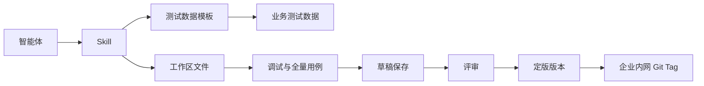
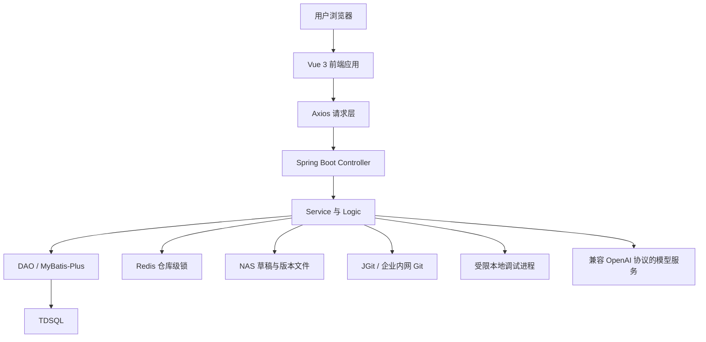

# 技能产品设计说明

## 1. 文档目的与范围

本文说明企业级 Skill 平台中“技能”业务域的产品设计，范围包括：

- 技能：作为一级业务入口，承载技能资产的统一访问与分级导航；
- 技能管理：负责 Skill 的检索、查看、创建入口、版本状态与团队资产管理；
- 技能开发：负责新建、导入、生成、编辑、调试、保存、评审与版本管理。

本文不展开智能体编排、MCP 管理、评测、Ops 等其他业务域的详细设计。

## 2. 产品总体设计

### 2.1 设计目标

平台面向业务人员、Skill 开发人员、团队管理员和审核人员，提供从需求形成到可装配版本交付的闭环。设计重点是将 Skill 作为可管理、可验证、可追溯的团队资产，而不是仅作为一次性生成的文本文件。

平台以 `SKILL.md` 为唯一强制主文件。`SKILL.md` 包含 YAML 前言区和具体步骤或使用说明；`scripts/` 用于保存可执行代码；使用 Python 脚本时必须提供 `requirements.txt`；业务规则、数据说明和测试数据可存放于 `references/`；静态资源可存放于 `assets/`。可选目录和文件仅在任务实际需要时创建，所有文件均在同一 Skill 工作区内管理，并与版本记录关联。

### 2.2 核心设计原则

| 原则 | 设计落实 |
| --- | --- |
| 资产先于代码 | 创建 Skill 时先明确名称、版本、可见范围、关联智能体、数据源和企业 Git 归属；代码生成后才进入调试与评审。 |
| 文件结构标准化 | 平台对生成、导入和保存的文件路径、`SKILL.md` 前言区、按需生成的目录、版本号和入口函数进行校验。 |
| 测试数据分层 | 测试模板用于约束生成内容和帮助快速验证；业务测试数据由业务人员维护，用于正式调试与验收。 |
| 变更可控 | 首次生成的新文件直接进入工作区；已有文件被修改时展示变更内容，由用户确认后应用。 |
| 版本可追溯 | 草稿、评审状态、定版版本和 Git Tag 相互关联；定版后的 `SKILL.md` 版本与 Git Tag 保持一致。 |
| 安全边界清晰 | 浏览器不保存数据库密钥和企业 Git 令牌；敏感连接信息由后端加密托管，代码调试在受限本地进程中执行。 |

### 2.3 业务对象关系



## 3. 信息架构

### 3.1 技能一级入口

左侧导航以“技能”为一级菜单，展开后包含：

- **技能管理**：查看和管理团队内的 Skill 资产；
- **技能开发**：进入当前 Skill 的开发工作区，或在未选择 Skill 时发起新建。

该结构将“资产管理”和“代码开发”保持在同一业务域下，避免用户在多个无关入口之间切换。

### 3.2 技能管理

技能管理页承担资产目录职责，展示 Skill 名称、说明、可见范围、版本、状态和更新时间等信息，并提供搜索、筛选和进入开发的入口。

页面创建入口仅允许创建私有或团队 Skill，不提供公共 Skill 创建能力。这样可以保证资产归属、数据权限和审核边界均落在明确的团队范围内。

### 3.3 技能开发

技能开发页由以下区域构成：

| 区域 | 主要内容 | 目的 |
| --- | --- | --- |
| 顶部状态区 | Skill 名称、草稿状态、版本、保存草稿、提交评审 | 表示当前工作对象和可执行的版本动作。 |
| 工作区切换区 | 关联智能体下拉框、Skill 下拉框、新建、删除 | 支持在同一团队上下文中切换智能体和 Skill。 |
| AI 对话区 | 需求输入、对话历史、递进式提示建议、测试数据模板 | 通过对话生成或修改工作区文件，并把业务约束传递给模型。 |
| 文件工作区 | 文件树、文件预览与编辑、Skill 元信息 | 查看和维护实际交付文件，不展示虚构目录或空白文档。 |
| 调试区 | 调试数据来源、JSON 输入、运行结果、失败日志、Token 消耗、调试记录 | 验证 `scripts/main.py` 的执行结果和测试用例结果。 |
| 日志区 | 操作日志、完整日志展开、单条下载、批量下载 | 支持问题定位和交付留痕。 |

## 4. 用户使用动线

### 4.1 在线创建并生成 Skill

1. 用户在技能管理中选择“创建 Skill”，或在技能开发页点击“新建”。
2. 用户先选择关联智能体，再进入开发模式选择：在线创建、从本地导入或从 Git 导入。
3. 选择在线创建后，填写名称、初始版本、描述、可见范围、数据源、企业 Git 仓库、创建方式和模型。
4. 创建成功后，平台仅创建空工作区和对应的 Skill 记录，不自动生成 `SKILL.md`、脚本或参考文件。
5. 用户选择测试数据模板，输入业务需求，模型基于需求、模板数据和当前工作区生成文件。
6. 首次生成的新增文件直接进入工作区；后续修改已有文件时，平台展示变更预览，用户确认后应用。
7. 平台校验文件结构、前言区、版本格式、入口函数和目录约束。仅在任务需要时生成 `scripts/`、`requirements.txt`、`references/`、`assets/`；校验失败时不保存，并返回具体原因。

### 4.2 本地导入与企业 Git 导入

**从本地导入**：用户选择本地 Skill 包，平台解析文件结构并验证必备文件与路径。解析通过后，文件进入当前工作区，由用户继续编辑、调试和评审。

**从 Git 导入**：用户在企业 Git 连接管理中配置企业内网仓库地址、用户名和访问令牌，令牌只提交给后端加密保存。导入时，后端使用已托管凭证读取分支或 Tag，列出符合规范的 Skill 包；用户选择后导入工作区，并保留仓库、分支或 Tag 来源信息。

### 4.3 测试数据与调试

测试数据分为三个层次：

| 层次 | 使用时机 | 内容与作用 |
| --- | --- | --- |
| 测试数据模板 | 生成前和快速验证时 | 定义输入字段、输出约束、典型案例和预期结果，为模型生成提供业务边界。 |
| 模板示例输入 | 单次快速调试时 | 从模板中选择一条代表性输入，直接调用 `handle(input_data)`。 |
| 业务测试数据 | 业务验收时 | 由业务人员补充和保存至 `references/test-data.json`，用于正式单条调试和全量用例运行。 |

当用户选择“模板完整用例（全量测试）”时，输入区展示完整模板数据，包括输入结构、输出约束和全部 `testCases`。点击“运行调试”后，系统按 `testCases` 逐条运行并汇总通过数、失败原因、执行日志和 Token 消耗。单条调试则使用一个 JSON 对象作为 `handle(input_data)` 的输入。

### 4.4 保存、评审与定版

1. 用户完成代码与测试数据修改后保存草稿。
2. 系统保存工作区文件，并以修订号避免覆盖其他成员刚刚保存的草稿。
3. 调试通过后，用户提交评审。
4. 审核人员完成审核后形成定版版本。
5. 定版时，平台将 `SKILL.md` 前言区中的 `version` 与 Git Tag 同步，形成可回溯的交付版本。
6. 草稿属于临时工作状态，可按平台清理策略定期清理；定版版本保留在 Git 与版本记录中。

## 5. 关键功能设计

### 5.1 AI 对话与递进式开发

AI 对话区不是一次性提示词入口。每次模型生成或修改完成后，平台根据当前任务、已生成文件、测试模板和上一轮结果生成后续建议，例如补充参数校验、补充异常案例、完善测试数据或更新指定脚本。用户可选择建议继续对话，也可输入新的修改要求。

模型输出必须符合《SKILL开发规范》。平台从模型结果中提取文件路径和内容后，执行以下校验：

- 必须存在全大写命名的 `SKILL.md`，且包含 YAML 前言区与具体步骤或使用说明；禁止以 `README.md`、`readme.md` 或其他文件代替主文件；
- YAML 前言区必须以 `---` 包裹，至少包含 `name`、`name_zh`、`description`、`version`、`tags`、`runEnv`、`digestValue`；其中 `digestValue` 由平台按业务文件内容计算 MD5，不由模型填写；
- `scripts/` 仅在需要可执行逻辑时生成；若生成 Python 脚本，必须同时生成 `requirements.txt`，并通过语法与单元测试校验；平台调试入口使用 `scripts/main.py` 的 `handle(input_data)`；
- `references/`、`assets/` 仅在实际使用时生成；正文引用的相对路径必须真实存在；禁止绝对路径、上级目录路径和外部 URL；
- 禁止独立 `.yaml` 或 `.yml` 文件、`README.md`、空文件、临时代码、缓存、测试产物、日志和构建者本地硬编码内容；
- `SKILL.md` 不超过 500 行；超过 100 行的参考文件应提供目录；Skill 应保持原子性，不整合其他 Skill 的代码或并存多版本脚本。

### 5.2 文件与版本管理

文件浏览器只呈现当前工作区中实际存在的文件。新建 Skill 的文件树为空，直到用户通过生成或导入写入文件。文件夹默认折叠，用户可按需展开。

工作区保存采用顺序保存与修订号校验，减少多人编辑时的覆盖风险。首次生成的新文件不展示“新文件与空文件”的无意义差异；已有文件的变更才进入差异确认流程。

平台在保存时根据当前文件计算 `digestValue`，避免摘要由模型或浏览器伪造。定版时，`SKILL.md` 的版本字段与 Git Tag 同步。

### 5.3 调试、日志与错误反馈

调试执行当前工作区内 `scripts/main.py` 的 `handle(input_data)` 函数。运行环境采用受限本地进程，使用临时目录、Python 隔离模式和 3 秒超时控制。该机制用于开发阶段的功能校验，不等同于生产运行环境。

调试结果展示：

- 输出结果与预期结果校验状态；
- 耗时、依赖调用次数和 Token 消耗；
- 退出码、标准输出、标准错误和失败原因；
- 单条或全量调试记录；
- 可展开的完整日志、单条下载和批量下载。

### 5.4 Skill 编写格式规范对照

技能开发工作区以《SKILL开发规范》作为生成、导入、编辑、调试和提交评审的共同校验依据。平台不另行定义相互冲突的文件协议。对应关系如下。

| 规范类别 | 《SKILL开发规范》要求 | 平台设计中的落实方式 |
| --- | --- | --- |
| 主文件 | 必须存在 `SKILL.md`，且文件名全大写；不得以 `README.md` 或其他名称替代。 | 文件树和导入校验以 `SKILL.md` 为主文件识别条件；缺失或名称不符时禁止保存、导入或提交评审。 |
| 目录与依赖 | `scripts/`、`references/`、`assets/` 按需使用；使用 Python 时必须提供 `requirements.txt`。 | 新建空 Skill 不预置任何文件。模型或用户新增 Python 脚本时，平台要求同时补充 `requirements.txt`；引用资料或静态资源时才创建对应目录。 |
| YAML 前言区 | 使用 `---` 包裹；`name`、`description` 为强制基础字段。扩展元信息包括 `version`、`name_zh`、`tags`、`runEnv`、`digestValue` 等。 | 编辑器对 YAML 前言区执行结构校验。`version` 与定版 Git Tag 同步；`digestValue` 由服务端根据工作区业务文件计算 MD5 并写回。 |
| 字段边界 | `version`、`name`、`name_zh`、`description`、`tags`、`runEnv`、`digestValue` 受长度约束；`executeAbility`、`changeRecord`、`license`、`clawVersion` 为可选字段。 | 表单和保存接口分别校验必填性、长度和格式；可选字段仅在用户或生成内容实际提供时写入，不填充无业务含义的默认值。 |
| 描述与命名 | `description` 应覆盖能力价值与触发场景，建议为 100–150 字符；目录名仅使用字母、数字和下划线，不以连字符开头或结尾。 | 生成提示要求描述同时说明“解决什么问题”和“何时使用”；创建、导入和保存时校验目录命名规则，并提示不符合要求的路径。 |
| 路径与资源 | 仅使用相对路径；被引用的 `references/`、`assets/` 文件必须存在；避免绝对路径和外部 URL。 | 文件保存接口拒绝绝对路径、`..` 上级路径和外部 URL；提交前检查文档内的本地资源引用是否可解析。 |
| 脚本质量 | 脚本应语法正确并通过单元测试，示例应简洁，仅保留任务特有规则。 | 调试区执行当前工作区脚本，返回标准输出、标准错误、退出码和失败原因；全量用例用于验证输入、输出和异常场景。 |
| 文档表达 | 使用明确的约束性表述；`SKILL.md` 不超过 500 行；超过 100 行的参考文件应提供目录。 | 模型生成提示与提交校验同步限制文件长度、冗余说明和缺失目录；不符合要求时给出具体位置与修复提示。 |
| 清理与原子性 | 清理临时代码、缓存、测试产物和日志；不得存在空文件、并存多版本脚本或跨 Skill 代码耦合。 | 保存和评审前执行文件清单检查；临时产物不进入版本提交，发现空文件、重复版本脚本或越界引用时阻断提交。 |
| 稳定性与安全 | Skill 定义与用户输入应有边界；过滤角色标记；限制输入长度；通过输出约束、示例与来源要求降低不确定性。 | 模型调用在服务端拼装系统规则、Skill 当前文件、测试模板和用户输入；用户输入按长度和危险角色标记校验，生成结果经文件协议校验后才进入工作区。 |

前言区的最小推荐写法如下。可选字段仅在实际适用时添加：

```yaml
---
version: 1.0.0
name: product_query
name_zh: 产品信息查询
description: 查询产品基础信息、状态和风险等级，适用于产品编码查询与风险提示场景。
tags: 产品,查询,风险提示
runEnv: all
digestValue: 由平台生成
dependency:
  python:
    - requests>=2.31.0
executeAbility: python
---
```

其中，`description` 应说明能力价值和触发场景；`dependency`、`executeAbility`、`changeRecord`、`license`、`clawVersion` 均为可选字段。`digestValue` 不允许由用户或模型伪造，定版前由后端重新计算。

## 6. 核心技术栈

### 6.1 前端

| 类别 | 技术 | 作用 |
| --- | --- | --- |
| 应用框架 | Vue 3、Composition API、TypeScript | 构建单页应用、组件状态和类型约束。 |
| 构建与工程化 | Vite、ESLint、Prettier、vue-tsc | 开发服务、构建、静态检查与代码格式控制。 |
| 路由与状态 | Vue Router 4、Pinia | 页面导航、权限路由和跨组件状态管理。 |
| 请求层 | Axios | 统一请求基地址、鉴权和错误处理。 |
| 界面与编辑器 | Element Plus、CodeMirror 6、Ace Editor | 表单、弹窗、文件编辑与语法高亮。 |
| 差异与数据展示 | diff、vue-json-pretty、Markdown 渲染组件 | 文件变更预览、JSON 展示和文档预览。 |

### 6.2 后端与基础设施

| 类别 | 技术 | 作用 |
| --- | --- | --- |
| Web 与业务框架 | Spring Boot、Spring Web、Spring Validation | REST API、参数校验和业务编排。 |
| 分层实现 | Controller、Service、Logic、DAO | 分离接口、业务编排、复杂规则与数据访问职责。 |
| 数据访问 | MyBatis-Plus 3.5.5、MyBatis XML、TDSQL | 业务数据持久化和复杂查询。 |
| 鉴权与权限 | JWT、JJWT、自定义拦截器、RBAC | 登录身份、团队上下文和接口权限控制。 |
| 缓存与并发控制 | Redis | 仓库级锁与缓存，避免并发 Git 操作冲突。 |
| 文件与版本 | NAS、JGit 5.12、企业内网 Git | 草稿文件、版本包、Git 提交、Tag 与导入来源管理。 |
| 运行与部署 | Tomcat、Kubernetes Client | 服务运行和容器化部署对接。 |
| 数据库 API 对接 | 后端安全代理 | 连接信息与密钥由服务端管理，浏览器不持有敏感凭证。 |

## 7. 前后端技术架构

### 7.1 架构分层



### 7.2 前端职责

前端负责页面交互、表单校验、文件浏览、代码预览与编辑、测试数据选择、调试结果展示和变更确认。前端不直接持有企业 Git 令牌、数据库密钥或内部服务认证信息。

前端通过 `/race-api` 访问后端 API。接口错误会在当前业务区域展示可理解的失败原因，避免仅以无响应或通用错误提示结束操作。

### 7.3 后端职责

后端负责鉴权、团队隔离、业务规则、文件保存、版本控制、企业 Git 凭证加密、模型调用代理、数据库 API 安全代理和调试进程调度。

涉及 Git 的操作统一由 `GitService` 调用 JGit，并使用 Redis 仓库级锁控制并发。涉及文件的操作均限制在该 Skill 对应的 NAS 工作目录内，禁止客户端传入绝对路径或上级目录路径。

### 7.4 数据与安全边界

- Skill 元信息、团队归属、版本状态、评审信息和企业 Git 连接元数据存储在业务数据库；
- 草稿文件、版本文件和导入文件存储在 NAS；
- Git 版本由平台内部版本仓库或企业内网 Git 承载；
- 企业 Git 令牌仅在提交时发送给后端，后端加密保存并以脱敏状态返回；
- 数据库地址和密钥不写入浏览器，由后端安全代理或环境变量管理；
- 模型调用凭证仅在服务端运行时配置中使用，不写入 Skill 文件或前端页面。

## 8. 交付边界

本设计覆盖 Skill 的创建、导入、生成、编辑、调试、日志、草稿、评审和定版链路。生产部署时，需要由企业补齐 TDSQL、Redis、NAS、企业内网 Git、身份认证、模型服务和 Kubernetes 等运行环境配置，并按照《工程架构与编码规范》完成发布与运维配置。
